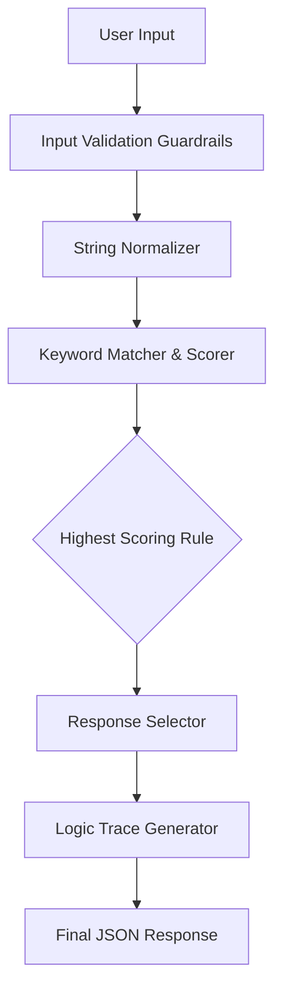

# Architecture of DecodeBot

DecodeBot operates on a rigid, straight-through pipeline designed for **traceability** and **compliance**.

## Flow Diagram

## Component Details

### 1. Guardrails (`guardrails.py`)
Checks for empty inputs, extremely long inputs, and specific blocked keywords. This prevents DOS-like attacks or unwanted queries at the highest layer.

### 2. Normalizer (`utils.py`)
Reduces the dimensionality of the user text.
- Converts to lowercase.
- Strips punctuation (preserving `+` and `#` for programming languages like C++).
- Removes extra whitespaces.

### 3. Matcher (`matcher.py`)
Assigns a deterministic score:
- **Priority 4:** Exact phrase match.
- **Priority 3:** Multiple keyword AND match.
- **Priority 2:** Single keyword OR match.
- Ties are broken deterministically by the order of rules in the configuration file.

### 4. Trace Generator (`trace.py`)
Builds a transparent object explaining the input routing decision, which the React frontend consumes to display the "White Box" logic UI.
